# Install FreeRadius and daloRadius

Runthrough installing FreeRadius 3 and daloRadius on Ubuntu 22.04. Note what version of Freeradius you're installing, it's slightly
different for FreeRadius 2. I recommend 3 for the smoothest install. If you run into errors with FreeRadius or Apache during
the install journalctl -xeu freeradius.service and journalctl -xeu apache2.service will point you in the right direction. 
I found errors most commonly caused by not updating the password and db info, and not having the correct permissions for 
Apache. You may also need to disable your firewall, or allow ports 1812 and 1813 through the firewall.  

Let's get started!

**Update System:**

```bash
sudo apt -y update
sudo apt -y upgrade
```
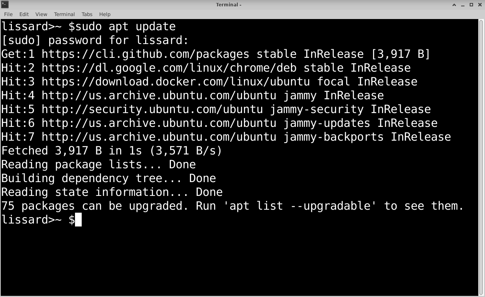
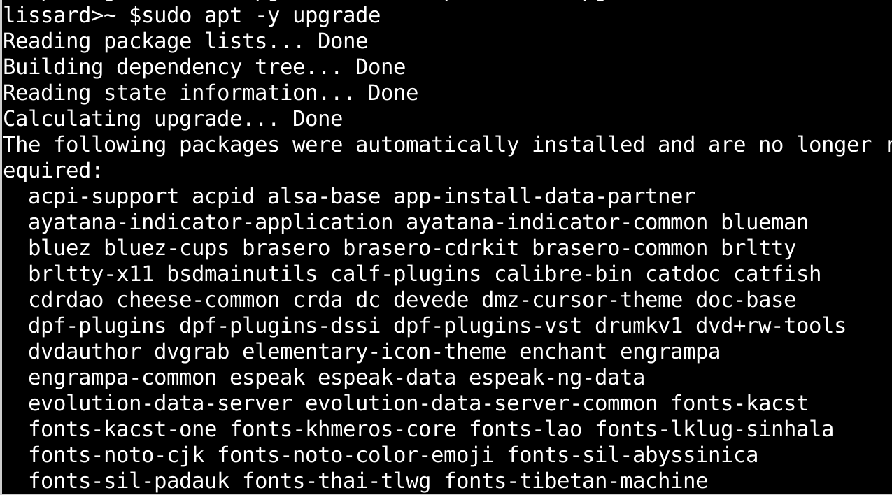

**Install Apache and PHP**

```bash
sudo apt -y install apache2
sudo apt -y install php libapache2-mod-php php-{gd,common,mail,mail-mime,mysql,pear,db,mbstring,xml,curl}
php -v
```
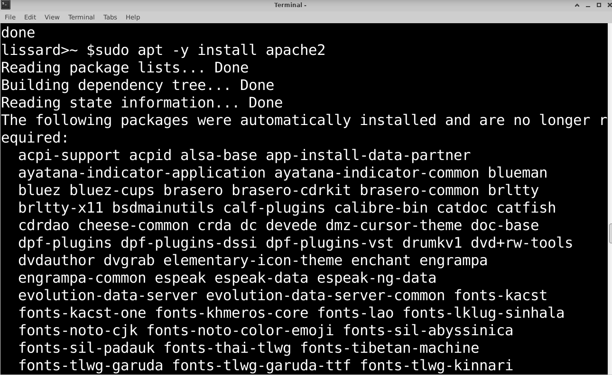
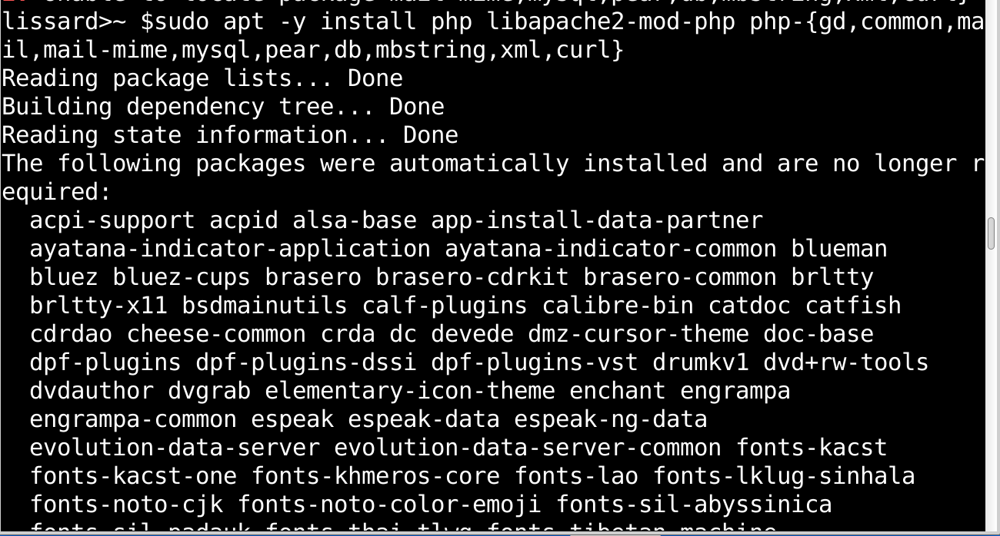

**Create Mariadb Database**

```bash
sudo apt update
sudo apt install mariadb-server
```
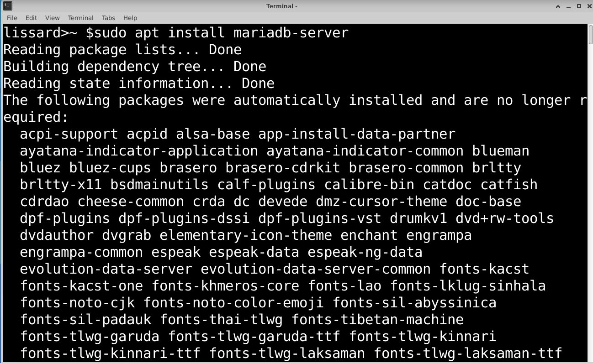

**Setup MySQL**

To somewhat mimick a production environment I'm going to make a secure password. You have the
option to change it again if needed. I also removed anonymous users, disallowed remote root
logins, and removed the test database. Press 'y' to reload privilege tables, and that's all for the sql installation. 
```bash
sudo mysql_secure_installation
```
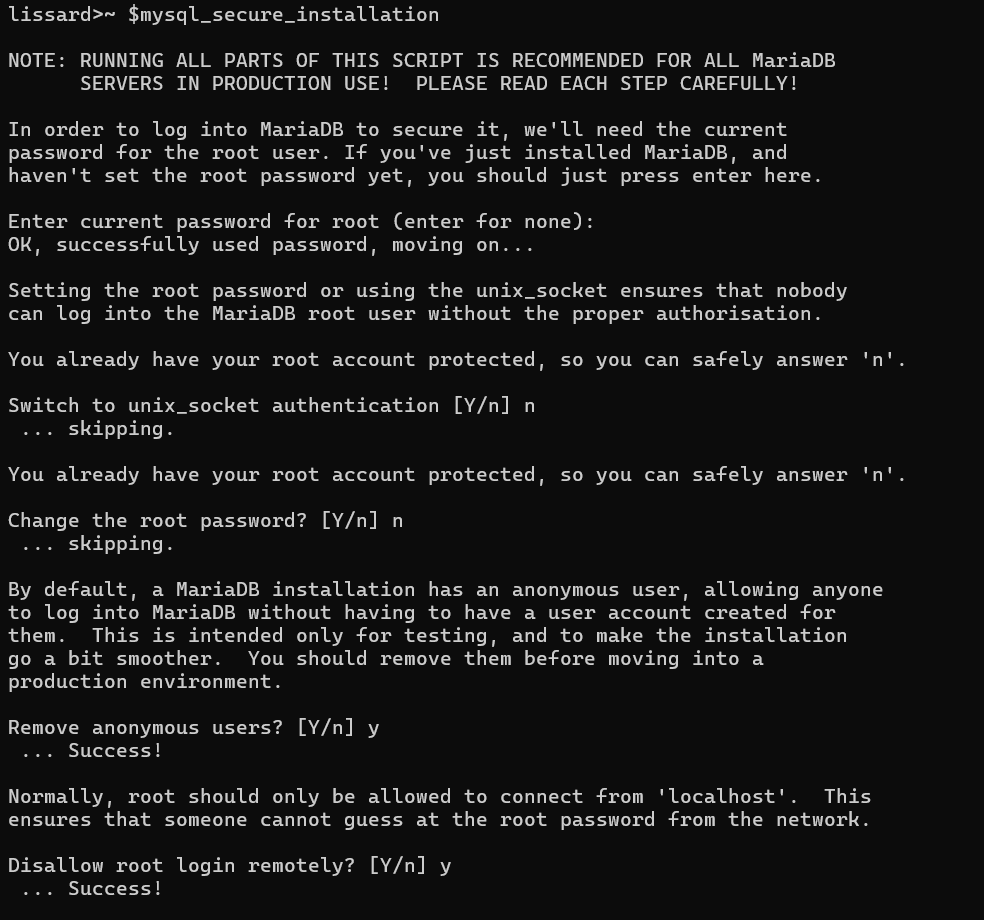
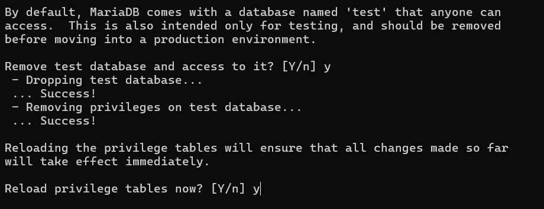

**Create Database**

After MySQL is configured, create your radius database. IDENTIFIED BY "password" << update to any password you prefer.
 Keep track of it, because you'll need to update the daloradius config file with the new password. 

```bash
sudo mysql -u root -p
CREATE DATABASE radius;
GRANT ALL ON radius.* TO radius@localhost IDENTIFIED BY "bananas25unite";
FLUSH PRIVILEGES;
QUIT
```
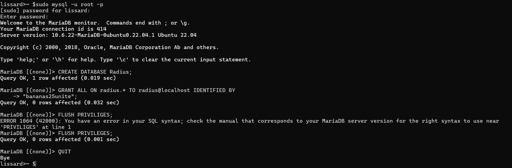

**Install FreeRadius**

Version 3 or newer is best. There's less concern with deleting current FreeRadius data during
the rest of the install. 

```bash
apt -y install freeradius freeradius-mysql freeradius-utils

```

**Import FreeRadius MysSQL database and scheme:**

```bash
mysql -u root -p radius < /etc/freeradius/*/mods-config/sql/main/mysql/schema.sql

```bash
Confirm the tables have been created

```bash
mysql -u root -p -e "use radius;show tables;"
```

**Create a soft linke for the SQL module under mods-enabled**

```bash
ln -s /etc/freeradius/*/mods-available/sql /etc/freeradius/*/mods-enabled/
```

**Configure SQL module** 

Update the database to MySQL, and  update the connection info. When I did this install the connection info was outside of the sql module. You can move it, but I 
kept it in the same position in the file. Comment out the  SSL sections if you don't have certs set up. I'll do that another time.  

```bash
nano /etc/freeradius/*/mods-enabled/sql
```

**Change group rights of /etc/freeradius/3.0/mods-enabled/sql**

```bash
chgrp -h freerad /etc/freeradius/*/mods-available/sql
chown -R freerad:freerad /etc/freeradius/*/mods-enabled/sql
```

**Enable FreeRadius and check status**

```bash
sudo systemctl enable freeradius
sudo systemctl status freeradius
```

**Install daloRADIUS**

If you have git installed already skip installing it again, and skip to cloning.

```bash
apt -y install git
git clone https://github.com/lirantal/daloradius.git
```

**Import daloRADIUS MySQL tables**

Pay attention to the version of Freeradius you're running. In version 2 there's a different command
that imports the tables. In version 2, this command wipes existing FreeRadius data.

```bash
mysql -u root -p radius < daloradius/contrib/db/fr3-mariadb-freeradius.sql
mysql -u root -p radius < daloradius/contrib/db/mariadb-daloradius.sql
```
**Move daloRADIUS** 
```bash
mv daloradius /var/www/
```
**Configure permissions**
```bash
cd /var/www/daloradius/app/common/includes/
cp daloradius.conf.php.sample daloradius.conf.php
chown www-data:www-data daloradius.conf.php
```
Update daloRADIUS config file
Update the database username, password, and database name. 
```bash
sudo nano daloradius.php
```
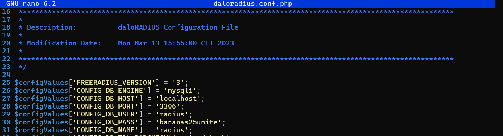

**Create var directory and its subdirectories, update ownership**
```bash
cd /var/www/daloradius/
mkdir -p var/log
mkdir -p var/backup
chown -R www-data:www-data var
```

**Configure Apache **

I have apache listening to 8001 for daloRadius because I have mkdocs on 8000 already. 

```bash
sudo nano /etc/apache2/ports.conf

#Apache Ports 
Listen 80
Listen 8001
<IfModule ssl_module>
  Listen 443
</IfModule>

<IfModule mod_gnutls.c>
  Listen 443
</IfModule>
```
**Configure virtual host operators**

```bash
sudo nano /etc/apache2/sites-available/operators.conf

<VirtualHost *:8001>
    ServerAdmin operators@localhost
    DocumentRoot /var/www/daloradius/app/operators

    <Directory /var/www/daloradius/app/operators>
        Options -Indexes +FollowSymLinks
        AllowOverride None
        Require all granted
    </Directory>

    <Directory /var/www/daloradius>
        Require all denied
    </Directory>

    ErrorLog ${APACHE_LOG_DIR}/daloradius/operators/error.log
    CustomLog ${APACHE_LOG_DIR}/daloradius/operators/access.log combined
 </VirtualHost>
```
**Configure virtual host for users**

```bash
sudo nano /etc/apache2/sites-available/users.conf

<VirtualHost *:80>
    ServerAdmin users@localhost
    DocumentRoot /var/www/daloradius/app/users

    <Directory /var/www/daloradius/app/users>
        Options -Indexes +FollowSymLinks
        AllowOverride None
        Require all granted
    </Directory>

    <Directory /var/www/daloradius>
        Require all denied
    </Directory>

    ErrorLog ${APACHE_LOG_DIR}/daloradius/users/error.log
    CustomLog ${APACHE_LOG_DIR}/daloradius/users/access.log combined
 </VirtualHost>
```
**Enable Virtual Hosts**

```bash
a2ensite users.conf operators.conf
```

**Create Operators and Users Directories**

```bash
mkdir -p /var/log/apache2/daloradius/operators
mkdir -p /var/log/apache2/daloradius/users

```
**Disable Default Virtual Host**

```bash
a2dissite 000-default.conf
```
**Enable Apache & Check Services**

```bash
systemctl enable apache2
systemctl status apache2
systemctl status freeradius

```

**`Access Management portal @ http://your_ip:8001`**
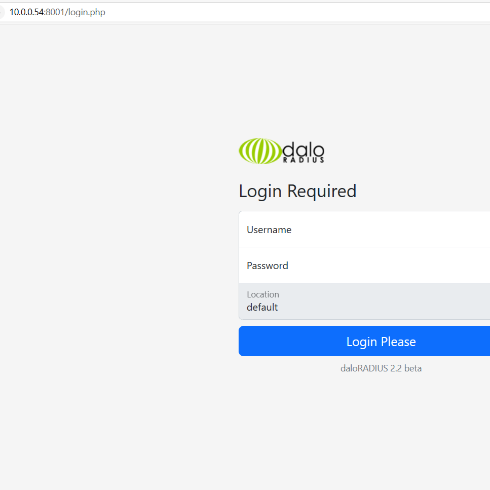

**`Access User Portal @ http://your_ip`**

**`The default login is: administrator // radius`** 
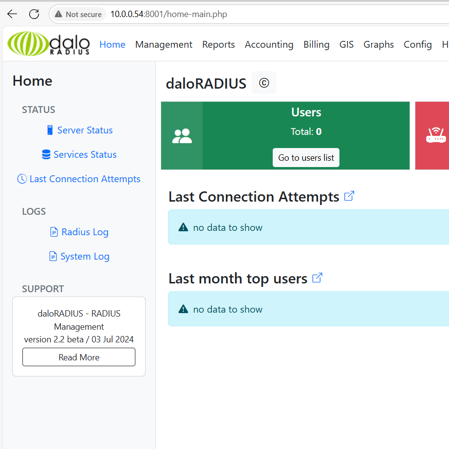

**Thank you and happy Installing!**
